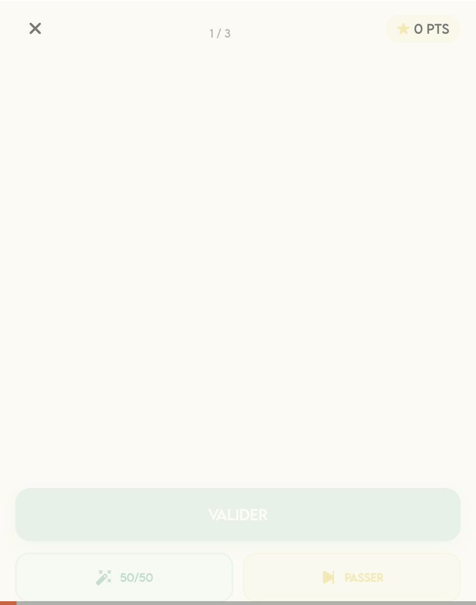
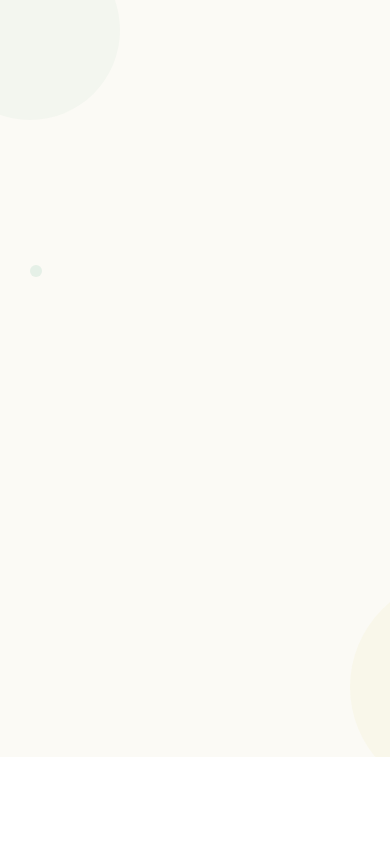
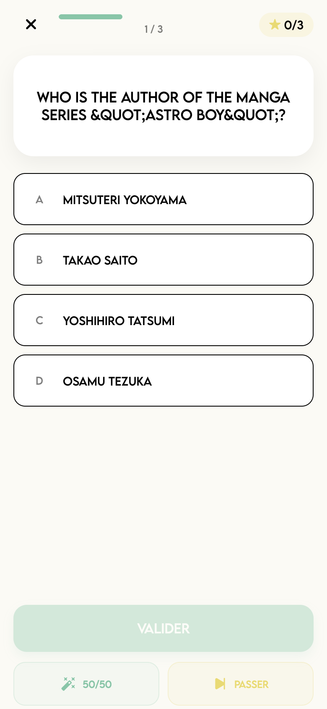
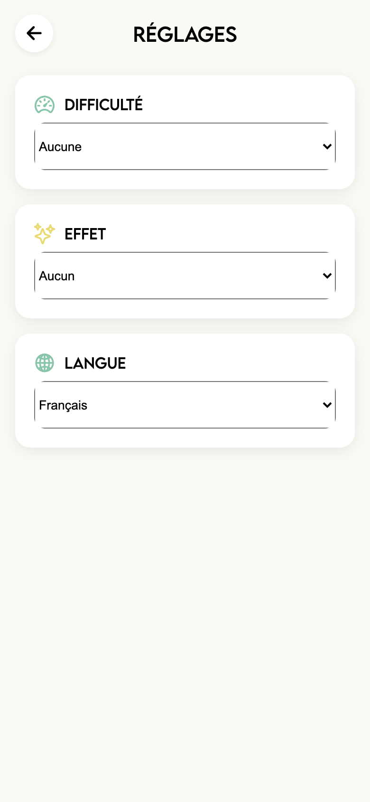
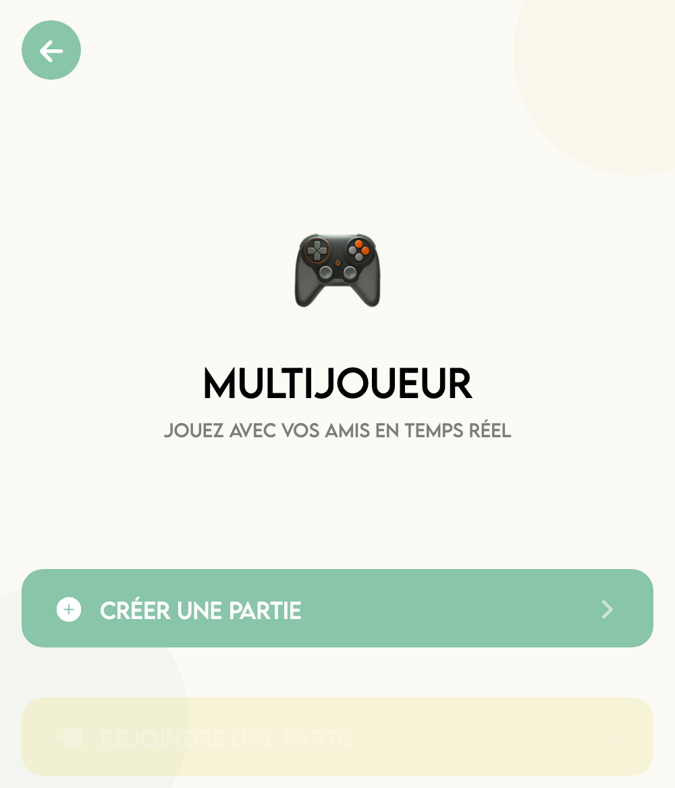
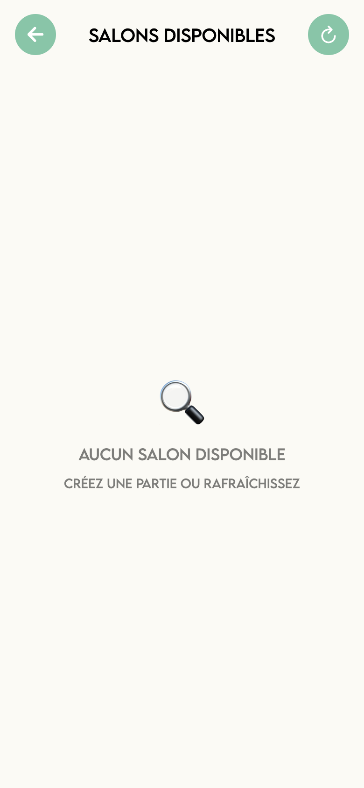
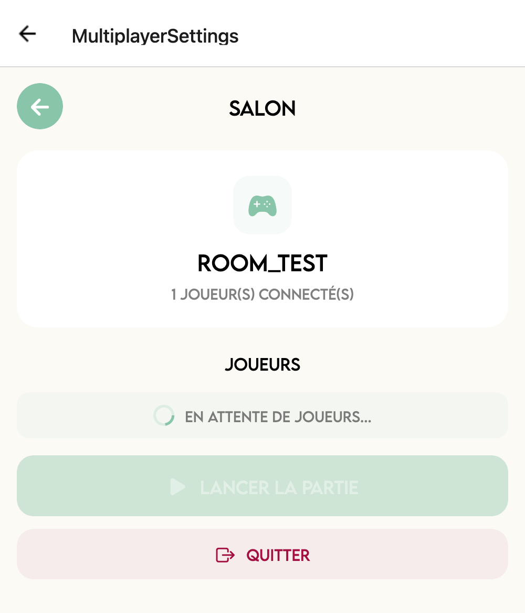

# Quiz App

Application de quiz multijoueur en temps réel, construite avec une **Clean Architecture** en monorepo.

## Démo

<p align="center">
  
</p>

## Aperçu

### Solo
<p align="center">
  
  
  
</p>

### Multijoueur
<p align="center">
  
  
  
</p>

## Stack technique

| Couche | Technologie |
|---|---|
| Mobile | React Native (Expo) |
| Serveur | NestJS (REST + WebSocket) |
| State management | Redux Toolkit |
| Données quiz | [Open Trivia Database](https://opentdb.com/) |
| Multijoueur | Socket.IO |
| Monorepo | pnpm workspaces + Turborepo |

## Architecture

```
packages/domain         # Types, enums, interfaces (ports) — zéro dépendance
packages/application    # Redux store, slices, thunks (use cases), selectors
packages/infrastructure # Implémentations des ports (API, Socket.IO)
apps/mobile             # App React Native (Expo)
apps/server             # Serveur NestJS (REST :3000, WebSocket :8082)
```

Le principe : **Domain <- Application <- Infrastructure & UI**. Les couches internes ne connaissent pas les couches externes, l'injection se fait via le store factory Redux.

## Fonctionnalités

- Quiz solo avec questions de l'Open Trivia Database
- Jokers : 50/50, passer une question
- Mode multijoueur en temps réel (rooms, matchmaking)
- Scoreboard

## Démarrage rapide

### Prérequis

- Node.js >= 18
- pnpm
- Docker (pour Redis en mode multijoueur)

### Installation

```bash
pnpm install
```

### Développement

#### Tout lancer (Redis + serveur + mobile)

```bash
pnpm dev:all
```

Cette commande fait tout : démarre Redis via Docker, build les packages, et lance le serveur + l'app mobile en parallèle.

#### Mode solo (pas besoin du serveur ni de Redis)

```bash
pnpm dev            # Lance l'app mobile (Expo)
```

#### Séparément

```bash
docker compose up -d   # Redis
pnpm dev:server        # Serveur NestJS (REST :3000, WebSocket :8082)
pnpm dev               # App mobile (Expo)
```

#### Build

```bash
pnpm build          # Build tous les packages (domain -> application -> infrastructure)
```

### Tests

```bash
# Tests unitaires (Vitest, tous les packages)
pnpm test

# Tests serveur (Jest)
cd apps/server && pnpm test

# Tests e2e serveur
cd apps/server && pnpm test:e2e
```

## Inspiration UI

- [Stepper](https://dribbble.com/shots/5586623-Stepper-IX)
- [ToDo App Dark Theme](https://dribbble.com/shots/14153121-ToDo-App-Dark-Theme)
- [Quizz App](https://dribbble.com/shots/15653050-Quizz-App)
